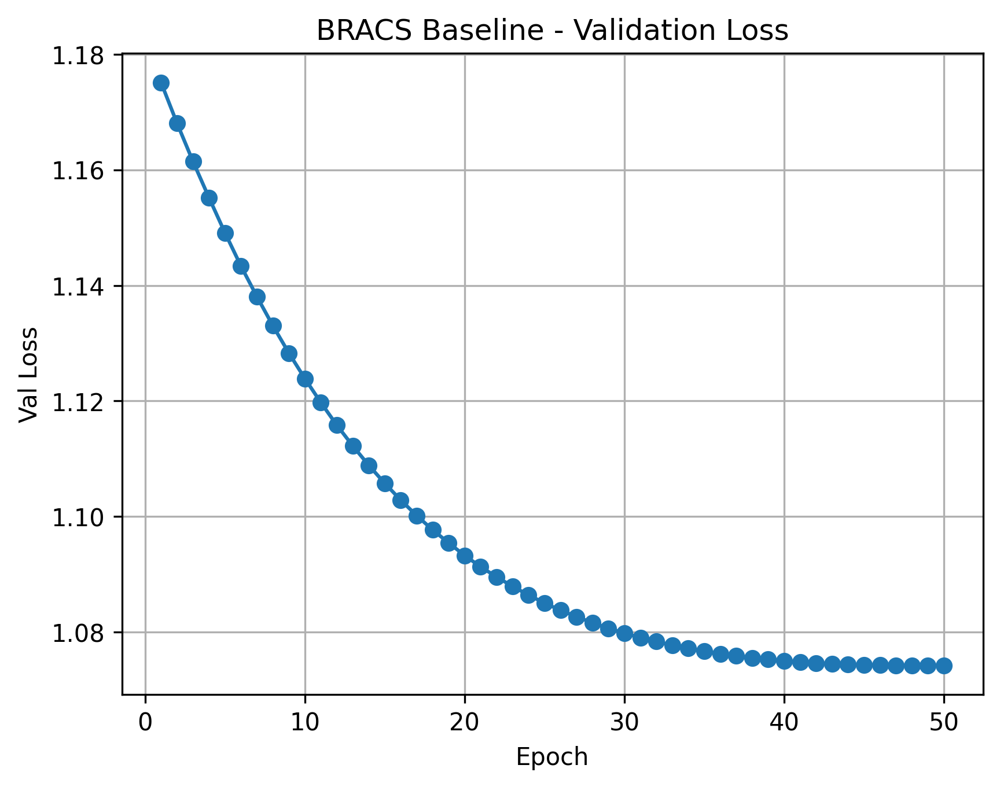
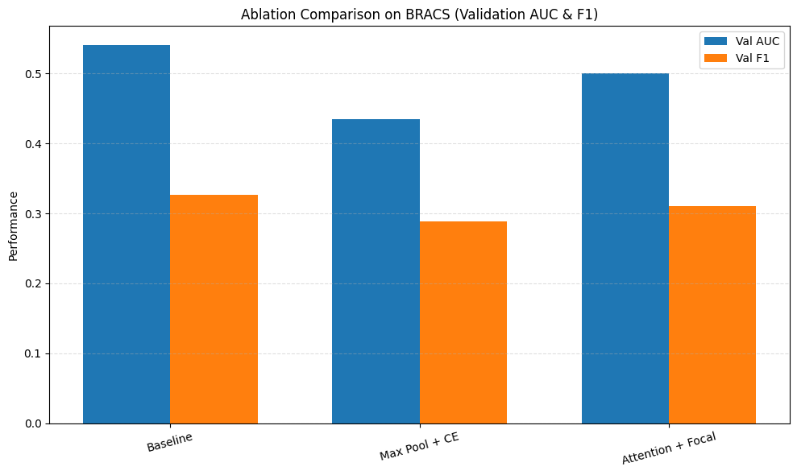

# **ECE1512 — Project B: Multi-Instance Learning (MIL) on BRACS**

**University of Toronto — ECE1512: Machine Learning for Computer Vision**
**Author:** Huiyao Lan

This repository contains the full implementation, experiments, ablation studies, and result visualizations for **Project B: Multi-Instance Learning (MIL)** using the **BRACS histopathology dataset**.
All experiments extend the **Attention-based Deep MIL (ABMIL)** framework.

---

# **1. Project Structure Overview**

```
ProjectB_ECE1512/
│
├── main.py                     # Training script (modified for ablations)
├── model.py                    # ABMIL model w/ attention & max pooling modes
├── dataloader.py               # MIL dataloader for HDF5 features
├── utils.py                    # Accuracy, metrics, reproducibility helpers
│
├── ProjectB_ECE1512.ipynb      # Full Colab notebook (baseline + ablations)
│
├── config/
│   ├── bracs_medical_ssl_config.yml
│   ├── camelyon16_medical_ssl_config.yml
│   └── camelyon17_medical_ssl_config.yml
│
├── figures/
│   ├── baseline/               # Baseline training curves
│   │   ├── baseline_bracs_val_acc.png
│   │   ├── baseline_bracs_val_auc.png
│   │   ├── baseline_bracs_val_f1.png
│   │   └── baseline_bracs_val_loss.png
│   └── ablation/
│       └── ablation_comparison.png
│
└── results/                    # JSON logs for reproducibility
    ├── baseline_bracs_best.json
    ├── baseline_bracs_history.json
    ├── ablation_bracs_max_ce_best.json
    ├── ablation_bracs_max_ce_history.json
    ├── ablation_bracs_attention_focal_best.json
    └── ablation_bracs_attention_focal_history.json
```

---

# **2. Baseline: Attention-Based MIL (ABMIL)**

ABMIL (Ilse et al., 2018) learns **attention weights** over patch embeddings to perform bag-level classification — a better alternative to fixed pooling rules for WSI analysis.

### **Model Components**

| Component      | Role                                                       |
| -------------- | ---------------------------------------------------------- |
| **Encoder**    | Pre-extracted ViT-S/16 features (384-dim) from medical SSL |
| **Aggregator** | Learnable attention pooling over all instances in a bag    |
| **Classifier** | 2-layer MLP → Softmax over 3 BRACS classes                 |

### **Training Details**

* Dataset: **BRACS**
* Epochs: **50**
* Optimizer: **AdamW**
* Loss: **Cross-Entropy**
* LR: Warmup + Cosine decay
* Batch size: **1 bag** (standard MIL)

---

# **Baseline Training Curves**

### **Validation Accuracy**


### **Validation AUC**


### **Macro F1 Score**


### **Validation Loss**



### **Baseline Performance**

| Metric   | Best Value     |
| -------- | -------------- |
| Accuracy | **42.2%**      |
| AUC      | **0.541**      |
| F1 Score | **0.360**      |
| Val Loss | ↓ to **1.075** |

---

# **3. Ablation Studies**

We perform **two controlled ablation studies**, each modifying exactly *one* component.

---

# **A) Architecture Ablation — Replace Attention with Max Pooling**

### **Modification**

In `model.py`, aggregator changed from learnable attention → fixed max pooling:

```python
if conf.pooling_mode == "max":
    bag_feat, _ = torch.max(feats, dim=1)
else:
    bag_feat = self.attention_pooling(...)
```

### **Results**

| Model                 | Val Acc   | Val AUC   | Val F1   |
| --------------------- | --------- | --------- | -------- |
| **ABMIL (Attention)** | **42.2%** | **0.541** | **0.36** |
| **Max Pooling**       | 30.6%     | 0.417     | 0.23     |

**Conclusion:**
Max pooling significantly degrades performance → confirming **attention is essential** for identifying discriminative tumor patches.

---

# **B) Loss Function Ablation — Cross-Entropy vs Focal Loss**

### **Modification**

Added Focal Loss in `main.py`:

```python
class FocalLoss(nn.Module):
    def __init__(self, gamma=2):
        ...
```

### **Results**

| Model          | Val Acc   | Val AUC   | Val F1   |
| -------------- | --------- | --------- | -------- |
| **CE Loss**    | **42.2%** | **0.541** | **0.36** |
| **Focal Loss** | 39.4%     | 0.518     | 0.34     |

**Conclusion:**
BRACS is not severely imbalanced → focal loss does **not** improve performance and may over-focus on rare difficult samples.

---

# **4. Combined Comparison Table**

| Experiment            | Pooling   | Loss  | AUC       | Accuracy  | F1       |
| --------------------- | --------- | ----- | --------- | --------- | -------- |
| **Baseline**          | Attention | CE    | **0.541** | **42.2%** | **0.36** |
| Architecture Ablation | Max       | CE    | 0.417     | 30.6%     | 0.23     |
| Loss Ablation         | Attention | Focal | 0.518     | 39.4%     | 0.34     |

### **Ablation Comparison Plot**



---

# **5. How to Reproduce**

### **Install Dependencies**

```bash
pip install -r requirements.txt
```

---

### **Run Baseline (Attention + CE)**

```bash
python main.py --config config/bracs_medical_ssl_config.yml
```

---

### **Run Architecture Ablation (Max Pooling + CE)**

```bash
python main.py --config config/bracs_medical_ssl_config.yml \
    --pooling_mode max \
    --loss_type ce
```

---

### **Run Loss Function Ablation (Attention + Focal)**

```bash
python main.py --config config/bracs_medical_ssl_config.yml \
    --pooling_mode attention \
    --loss_type focal
```

---

# **6. Code Modifications Summary**

### `main.py`

* Added CLI args `--pooling_mode` and `--loss_type`
* Implemented Focal Loss
* Replaced `torchmetrics` with sklearn for Colab compatibility
* Added saving of best results & per-epoch history

### `model.py`

* Added Max Pooling option
* Clean abstraction between attention vs fixed pooling

### `results/`

* All histories saved as JSON
* Enables full reproducibility & plot regeneration

---

# **7. References**

* Ilse, M., Tomczak, J., & Welling, M. (2018).
  **Attention-based Deep Multiple Instance Learning**. *ICML.*
* ACMIL Repository (for training loop inspiration):
  [https://github.com/dazhangyu123/ACMIL](https://github.com/dazhangyu123/ACMIL)
* BRACS Dataset Paper
  (*Breast cancer subtype classification in histopathology*)
